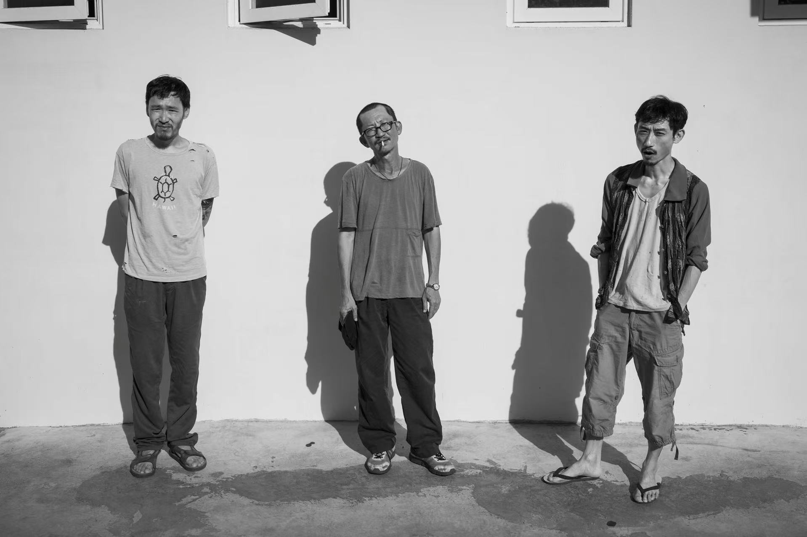
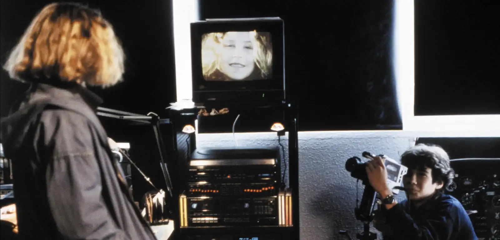
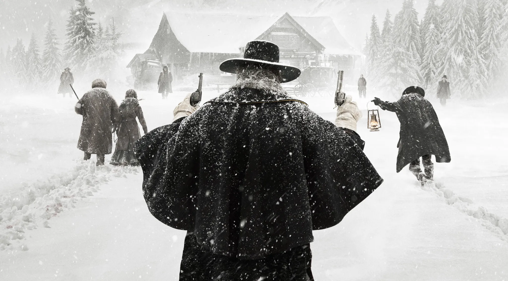

This page collects a few film stills I like. I keep the page quiet and visual, with minimal text.

::: {.picture-grid}
::: {.picture-item}
{fig-alt="Film still from Film Title"}

**The Great Buddha+**  
Huang Hsin-yao, 2017
:::

::: {.picture-item}
{fig-alt="Film still from Film Title"}

**Benny's Video**  
Michael Haneke, 1992
:::

::: {.picture-item}
{fig-alt="Film still from Film Title"}

**Lock, Stock and Two Smoking Barrels**  
Guy Ritchie, 1998
:::

::: {.picture-item}
{fig-alt="Film still from Film Title"}

**The Hateful Eight**  
Quentin Tarantino, 2015
:::
:::

<!--
To replace a placeholder with your own screenshot, put the image in
images/pictures/ and replace the placeholder block with syntax like:

{fig-alt="Film still from Film Title"}

Then update the caption below it.
-->
